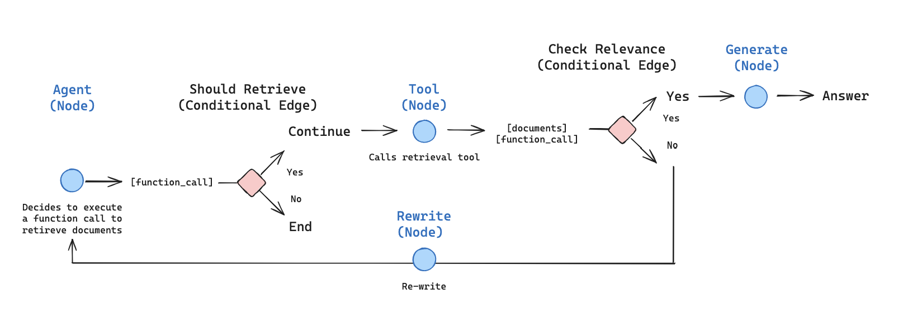

# Vietnam-Public-Service-Chatbot
Chatbot with Advanced RAG for Vietnam Public Service question    
Trong đồ án này tôi sẽ code 2 kiến trúc của hệ thống chatbot RAG:   
1. Agentic RAG:    
   
https://github.com/langchain-ai/langgraph/blob/main/examples/rag/langgraph_agentic_rag.ipynb    
2. Self-RAG:    
    
cho 5 tập dữ liệu để so sánh:    
PopQA TQA Pub ARC Bio    
Sau đó tôi sẽ ứng dụng kiến trúc Self-RAG vào hệ thống hỏi đáp cho hành chính công tại Việt Nam.    